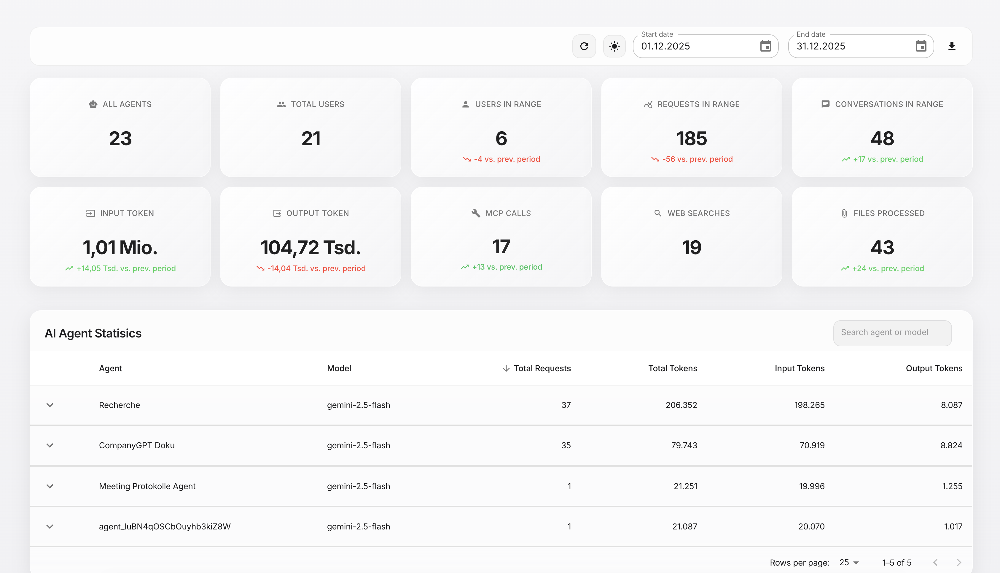

# LibreChat Admin Dashboard

[](https://github.com/innFactory/librechat-admin-dashboard/actions/workflows/ci.yml)
[](LICENSE)

A dashboard for monitoring [LibreChat](https://github.com/danny-avila/LibreChat) usage metrics, token consumption, and agent statistics. Right now, it's just a proof of concept. If you find any issues or have feature requests, please open an issue.



## Features

- 📊 Real-time metrics (active users, tokens, requests)
- 🤖 Agent and model analytics
- 📈 Interactive charts with MUI X Charts
- 🌙 Dark/Light mode
- 🔐 Password protection
- 🐳 Docker ready

## Quick Start

### Prerequisites

- Node.js >= 20
- MongoDB (LibreChat database)

### Development

```bash
npm install

# Configure environment
cp .env.example .env.local
# Edit .env.local with your MongoDB URI and password

npm run dev
```

Open [http://localhost:3000](http://localhost:3000)

### Docker

```bash
docker build -t librechat-dashboard .

docker run -p 3000:3000 \
  -e MONGODB_URI="mongodb://host:27017" \
  -e MONGODB_DB_NAME="librechat" \
  -e DASHBOARD_PASSWORD="your-password" \
  librechat-dashboard
```

## Environment Variables

| Variable | Required | Description |
|----------|----------|-------------|
| `MONGODB_URI` | Yes | MongoDB connection string |
| `DASHBOARD_PASSWORD` | Yes | Dashboard login password |
| `SESSION_SECRET` | No | Session signing secret (auto-generated) |
| `NEXT_PUBLIC_BASE_PATH` | No | Base path for reverse proxy (e.g., `/dashboard`) |

## Reverse Proxy / Kubernetes Ingress

The official Docker images are built with `NEXT_PUBLIC_BASE_PATH=/dashboard`, meaning the app expects to run under the `/dashboard` path.

### Kubernetes Ingress Example

```yaml
apiVersion: networking.k8s.io/v1
kind: Ingress
metadata:
  name: dashboard-ingress
spec:
  rules:
  - host: your-domain.com
    http:
      paths:
      - path: /dashboard
        pathType: Prefix
        backend:
          service:
            name: dashboard-service
            port:
              number: 3000
```

No `rewrite-target` annotation is needed since the app already expects requests at `/dashboard`.

### Custom Base Path

To use a different base path, rebuild the Docker image:

```bash
docker build --build-arg NEXT_PUBLIC_BASE_PATH=/your-path -t librechat-dashboard .
```

### Local Development

For local development without a base path, simply run:

```bash
npm run dev
```

The app will be available at `http://localhost:3000` (without any path prefix).

> **Note**: `NEXT_PUBLIC_BASE_PATH` is baked into the build at compile time. You must rebuild when changing this value.

## Development Commands

```bash
npm run dev          # Start dev server
npm run build        # Production build
npm run lint         # Run linter
npm run type-check   # TypeScript check
npm test             # Run tests
```

## License

MIT - see [LICENSE](LICENSE)

## Credits

Developed by [innFactory GmbH](https://innfactory.de) & [innFactory AI Consulting GmbH](https://innfactory.ai)

For managed LibreChat hosting with EU GDPR compliance, visit [CompanyGPT](https://company-gpt.com)
